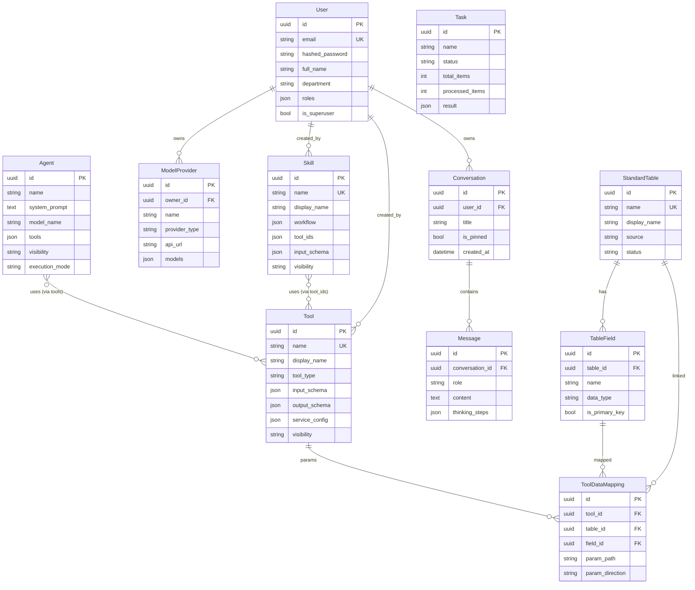

# Nebula 星图：Unified Agent Portal 设计与实施计划 v2.1

> **更新日期**: 2026-01-27  
> **版本说明**: 本文档融合了原始设计规范与 Native Function Calling 架构升级方案，并以仓库代码为“事实来源”。
>
> **快速阅读**: 如需去掉代码示例、快速把握“架构/功能/逻辑/模型/界面/API/规划/进度”，先读 `docs/implementation_plan_simple.md`。

---

## 0. 与代码对齐说明

### 0.1 当前代码基线

- 后端：FastAPI + SQLModel + PostgreSQL（`backend/app`）
- 前端：React + TypeScript + Vite（`frontend/src`）
- 部署：Docker Compose（`docker-compose.yml`、`docker-compose.override.yml`、`docker-compose.coolify.yml`）

### 0.2 关键现状/差异（需要在后续阶段收敛）

- **Memory**：当前为进程内 `MemoryStore`（`backend/app/engine/memory.py`），不支持多副本共享；规划引入 Redis。
- **多模型**：服务商配置以 DB `ModelProvider` 为主（`backend/app/models/model_provider.py`），`LLMGateway` 动态选择适配器（`backend/app/llm/gateway.py`）；环境变量 `DEEPSEEK_*` 目前不是可靠 fallback。
- **权限**：`Tool/Skill/Agent` 模型字段采用 `visibility=public/department/role`，但 `backend/app/core/permissions.py` 仍按 `public/internal/private` 判定（需要统一，否则 department/role 会被错误拒绝）。
- **前端接入**：`/data-standards`、`/agents`、`/model-providers` 已接入真实 API；`/tools`、`/skills` 页面仍以 Mock/UI 骨架为主，待对接 `/api/v1/tools`、`/api/v1/skills`。

---

## 1. 平台定位

**核心职责**：编排层 + 标准化层 + 交互层

| 做什么 | 不做什么 |
|--------|---------|
| ✅ 提供自然语言交互入口 | ❌ 数据存储和计算 |
| ✅ 编排调度外部服务 (Native Function Calling) | ❌ 模型训练和推理 |
| ✅ 知识工程管理 (Tool/Skill/Agent) | ❌ ETL 加工 |
| ✅ 思维链可视化 + 结果渲染 | ❌ 重计算引擎 |
| ✅ 多模型切换与统一调用 | ❌ 模型部署运维 |

---

## 2. 分层架构设计

### 2.1 整体架构图

```
┌─────────────────────────────────────────────────────────────────────────────┐
│                      Unified Agent Portal（统一智能交互入口）                │
├─────────────────────────────────────────────────────────────────────────────┤
│                                                                              │
│  ╔═══════════════════════════════════════════════════════════════════════╗  │
│  ║                    🧠 LLM 编排层 (Native Function Calling)            ║  │
│  ╠═══════════════════════════════════════════════════════════════════════╣  │
│  ║  ┌─────────────┐  ┌─────────────┐  ┌─────────────┐  ┌─────────────┐  ║  │
│  ║  │  Planner    │  │  Executor   │  │  Validator  │  │   Memory    │  ║  │
│  ║  │  规划层     │  │  执行层     │  │  验证层     │  │   记忆层    │  ║  │
│  ║  │             │  │             │  │             │  │             │  ║  │
│  ║  │ • 意图理解  │  │ • Tool调用  │  │ • 逻辑校验  │  │ • 会话上下文│  ║  │
│  ║  │ • 多模型路由│  │ • DAG编排   │  │ • 事实核查  │  │ • 用户画像  │  ║  │
│  ║  │ • 模式切换  │  │ • 流式输出  │  │ • 合规审查  │  │ • 任务模式  │  ║  │
│  ║  └─────────────┘  └─────────────┘  └─────────────┘  └─────────────┘  ║  │
│  ╚═══════════════════════════════════════════════════════════════════════╝  │
│                                      ↓                                       │
│  ╔═══════════════════════════════════════════════════════════════════════╗  │
│  ║                    📚 知识工程层 (Tool/Skill/Agent)                   ║  │
│  ╠═══════════════════════════════════════════════════════════════════════╣  │
│  ║                                                                        ║  │
│  ║  ┌─ Tool (原子工具) ─────────────────────────────────────────────────┐║  │
│  ║  │ 科创评分模型 │ 企业查询API │ 工商数据API │ 关系图谱查询 │ ...    │║  │
│  ║  └──────────────────────────────────────────────────────────────────┘ ║  │
│  ║                          ↓ 组合编排                                    ║  │
│  ║  ┌─ Skill (组合技能) ────────────────────────────────────────────────┐║  │
│  ║  │ 企业全景分析 │ 科创白名单生成 │ 交易对手挖掘 │ ...               │║  │
│  ║  └──────────────────────────────────────────────────────────────────┘ ║  │
│  ║                          ↓ 业务封装                                    ║  │
│  ║  ┌─ Agent (业务代理) ────────────────────────────────────────────────┐║  │
│  ║  │ 企业主体识别 │ 科创评价 │ 客户价值评估 │ 交易对手挖掘 │ 征信评分 │║  │
│  ║  └──────────────────────────────────────────────────────────────────┘ ║  │
│  ╚═══════════════════════════════════════════════════════════════════════╝  │
│                                      ↓                                       │
│  ╔═══════════════════════════════════════════════════════════════════════╗  │
│  ║                    🔌 服务适配层 (统一接口)                           ║  │
│  ╠═══════════════════════════════════════════════════════════════════════╣  │
│  ║  ┌─────────────┐  ┌─────────────┐  ┌─────────────┐  ┌─────────────┐  ║  │
│  ║  │ LLM Gateway │  │  模型平台   │  │  数仓 API   │  │  外部数据   │  ║  │
│  ║  │ (多模型)    │  │ (ML模型)    │  │             │  │  (工商等)   │  ║  │
│  ║  └─────────────┘  └─────────────┘  └─────────────┘  └─────────────┘  ║  │
│  ╚═══════════════════════════════════════════════════════════════════════╝  │
└─────────────────────────────────────────────────────────────────────────────┘
```

### 2.2 核心能力层详解

| 层 | 职责 | 技术实现 |
|----|------|---------|
| **Planner** | 意图理解、Agent 路由、任务分解 | LangGraph + Native Function Calling |
| **Executor** | 调用 Tool/Skill、并行执行、流式输出 | LangGraph DAG + 异步执行 |
| **Validator** | 结果校验、合规检查、异常处理 | LLM + 规则引擎 |
| **Memory** | 会话上下文、用户偏好、任务复用 | PostgreSQL 持久化 + 进程内 MemoryStore（规划 Redis） |

### 2.3 运行时流程 (Native Function Calling)

```
用户输入
    ↓
┌────────────────────────────────────────────────────────────────┐
│ LLM (with tools definition)                                    │
│ - 分析意图                                                      │
│ - 返回 tool_use (要调用哪些工具)                                │
└────────────────────────────────────────────────────────────────┘
    ↓ tool_use
┌────────────────────────────────────────────────────────────────┐
│ Executor                                                        │
│ - 执行工具调用                                                  │
│ - 发射 SSE 事件 (thinking, tool_call, tool_result)             │
└────────────────────────────────────────────────────────────────┘
    ↓ tool_result
┌────────────────────────────────────────────────────────────────┐
│ LLM (继续处理)                                                  │
│ - 分析结果，可能继续调用工具                                    │
│ - 或生成最终回答                                                │
└────────────────────────────────────────────────────────────────┘
    ↓ (循环直到 stop_reason != "tool_use")
最终回答 → 前端渲染
```

---

## 3. 知识工程体系 (核心升级)

### 3.1 三层知识模型

| 层级 | 定义 | 粒度 | 管理方式 |
|------|------|------|---------|
| **Tool** | 最小可调用单元，封装单一能力 | 原子级 | 数据库 + 前端管理 |
| **Skill** | 多 Tool 的 DAG 编排 | 模块级 | 可视化编排器 |
| **Agent** | 业务场景封装，含意图理解 | 任务级 | 配置管理 |

### 3.2 Tool (工具) 数据模型

```python
class Tool(SQLModel, table=True):
    """工具定义 - 最小可调用单元"""
    id: uuid.UUID = Field(default_factory=uuid.uuid4, primary_key=True)
    name: str = Field(unique=True, index=True)    # 唯一标识 (如 kechuang_score)
    display_name: str                              # 显示名称
    description: str                               # 描述 (给 LLM 理解)
    
    # === 类型与后端配置 ===
    tool_type: Literal["ml_model", "data_api", "external_api", "builtin"]
    service_config: dict = Field(default_factory=dict)
    # ML模型示例: {
    #   "platform": "model_factory",
    #   "model_id": "kechuang_score_v2",
    #   "version": "latest"
    # }
    
    # === Function Calling Schema (核心) ===
    input_schema: dict       # JSON Schema 格式
    output_schema: dict      # 输出结构定义
    examples: list[dict]     # 示例调用 (帮助 LLM 理解)
    
    # === 元数据 ===
    version: str = "1.0.0"
    status: Literal["draft", "active", "deprecated"] = "active"
    category: str = "general"
    tags: list[str] = Field(default_factory=list)
    
    # === 权限控制 ===
    visibility: Literal["public", "department", "role"] = "public"
    allowed_departments: list[str] = Field(default_factory=list)
    allowed_roles: list[str] = Field(default_factory=list)
    
    # === 统计 ===
    call_count: int = 0
    avg_latency_ms: float = 0.0
    success_rate: float = 1.0
    
    created_at: datetime = Field(default_factory=datetime.utcnow)
    updated_at: datetime = Field(default_factory=datetime.utcnow)
```

**Tool 示例数据**:
```json
{
  "name": "kechuang_score",
  "display_name": "科创能力评分",
  "description": "对企业进行科创能力五维评分（创新、增长、稳定、合规、合作）。需要企业统一社会信用代码作为输入。",
  "tool_type": "ml_model",
  "service_config": {
    "platform": "model_factory",
    "model_id": "kechuang_score_v2",
    "version": "latest",
    "timeout_ms": 10000
  },
  "input_schema": {
    "type": "object",
    "properties": {
      "credit_code": {
        "type": "string",
        "description": "企业统一社会信用代码"
      },
      "include_details": {
        "type": "boolean",
        "default": true,
        "description": "是否返回各维度详细分数"
      }
    },
    "required": ["credit_code"]
  },
  "output_schema": {
    "type": "object",
    "properties": {
      "total_score": {"type": "number", "description": "综合评分 0-100"},
      "dimensions": {
        "type": "object",
        "properties": {
          "innovation": {"type": "number"},
          "growth": {"type": "number"},
          "stability": {"type": "number"},
          "compliance": {"type": "number"},
          "cooperation": {"type": "number"}
        }
      }
    }
  },
  "examples": [
    {
      "input": {"credit_code": "91320500XXXX"},
      "output": {"total_score": 85.5, "dimensions": {"innovation": 90, "growth": 82}}
    }
  ],
  "visibility": "department",
  "allowed_departments": ["公司金融部", "科技金融部"]
}
```

### 3.3 Skill (技能) 数据模型

```python
class Skill(SQLModel, table=True):
    """技能定义 - 多工具 DAG 编排"""
    id: uuid.UUID = Field(default_factory=uuid.uuid4, primary_key=True)
    name: str = Field(unique=True, index=True)
    display_name: str
    description: str
    
    # === DAG 编排定义 (可视化编辑器生成) ===
    workflow: dict = Field(default_factory=dict)
    
    # === 关联的工具 ===
    tool_ids: list[uuid.UUID] = Field(default_factory=list)
    
    # === 输入输出 (聚合自 Tool 或手动定义) ===
    input_schema: dict
    output_schema: dict
    
    # === 元数据 ===
    status: Literal["draft", "active", "deprecated"] = "active"
    category: str
    
    # === 权限 (继承或覆盖) ===
    visibility: Literal["public", "department", "role"] = "public"
    allowed_departments: list[str] = Field(default_factory=list)
    allowed_roles: list[str] = Field(default_factory=list)
```

**Skill Workflow 定义格式**:
```json
{
  "name": "enterprise_full_analysis",
  "display_name": "企业全景分析",
  "description": "综合查询企业基本信息、科创评分、关联企业",
  "workflow": {
    "nodes": [
      {
        "id": "step1",
        "tool": "enterprise_query",
        "params_mapping": {
          "query": "$.input.company_name"
        }
      },
      {
        "id": "step2",
        "tool": "kechuang_score",
        "depends_on": ["step1"],
        "params_mapping": {
          "credit_code": "$.step1.credit_code"
        }
      },
      {
        "id": "step3",
        "tool": "relation_graph",
        "depends_on": ["step1"],
        "params_mapping": {
          "credit_code": "$.step1.credit_code",
          "depth": 2
        }
      }
    ],
    "output_mapping": {
      "enterprise": "$.step1",
      "score": "$.step2",
      "relations": "$.step3"
    }
  }
}
```

### 3.4 Agent (业务代理) 数据模型

```python
class AgentConfig(SQLModel, table=True):
    """Agent 配置 - 业务场景封装"""
    id: uuid.UUID = Field(default_factory=uuid.uuid4, primary_key=True)
    name: str = Field(unique=True, index=True)
    display_name: str
    description: str
    icon: str = "🤖"
    
    # === 可用的工具和技能 ===
    available_tool_ids: list[uuid.UUID] = Field(default_factory=list)
    available_skill_ids: list[uuid.UUID] = Field(default_factory=list)
    
    # === 系统提示词 ===
    system_prompt: str
    
    # === 输出渲染 ===
    output_component: str = "markdown"
    
    # === 执行模式 ===
    execution_mode: Literal["realtime", "batch", "auto"] = "realtime"
    batch_config: dict | None = None
    
    # === 权限 ===
    visibility: Literal["public", "department", "role"] = "public"
    allowed_departments: list[str] = Field(default_factory=list)
    allowed_roles: list[str] = Field(default_factory=list)
    
    status: Literal["draft", "active", "deprecated"] = "active"
```

---

## 4. 多模型支持架构

### 4.1 LLM Gateway 设计

#### 4.1.1 代码现状（以仓库为准）

- Gateway：`backend/app/llm/gateway.py`，根据 `provider_id`（UUID）或 `provider_type`（字符串）从 DB 读取 `ModelProvider` 并动态创建 Adapter，同时支持按 `model` 名称推断 provider。
- Adapters：`backend/app/llm/adapters/openai_adapter.py`（OpenAI-compatible：openai/deepseek/qwen/moonshot/zhipu）、`backend/app/llm/adapters/anthropic_adapter.py`。
- Provider 配置来源：`backend/app/models/model_provider.py`（支持 presets 初始化），前端管理入口为 `frontend/src/components/ModelSettings`。
- 仍需完善：
  - `gemini`、`baidu` 等 provider_type 在 presets 中存在，但当前无 Adapter（调用会失败）。
  - `/api/v1/chat/stream` 文档注释中提到“env fallback”，但当前实际执行依赖 DB 命中可用 provider（无可用 provider 时会直接报错）。

#### 4.1.2 目标设计（保留）

```python
class LLMProvider(str, Enum):
    CLAUDE = "claude"
    QWEN = "qwen"
    GPT = "openai"
    DEEPSEEK = "deepseek"
    GLM = "glm"

class LLMConfig(BaseModel):
    """LLM 配置"""
    provider: LLMProvider
    model: str                      # 具体模型名
    api_key: str | None = None      # 可选覆盖全局配置
    base_url: str | None = None
    supports_function_calling: bool = True
    max_tokens: int = 4096
    
class LLMGateway:
    """多模型网关"""
    
    def __init__(self, default_config: LLMConfig):
        self.default_config = default_config
        self.providers = {
            LLMProvider.CLAUDE: ClaudeAdapter(),
            LLMProvider.QWEN: QwenAdapter(),
            LLMProvider.GPT: OpenAIAdapter(),
            LLMProvider.DEEPSEEK: DeepSeekAdapter(),
            LLMProvider.GLM: GLMAdapter(),
        }
    
    async def chat_with_tools(
        self,
        messages: list[dict],
        tools: list[dict],
        config: LLMConfig | None = None
    ) -> LLMResponse:
        """统一的工具调用接口"""
        cfg = config or self.default_config
        adapter = self.providers[cfg.provider]
        
        return await adapter.chat_with_tools(
            messages=messages,
            tools=tools,
            model=cfg.model,
            max_tokens=cfg.max_tokens
        )
```

### 4.2 模型适配器接口

```python
class LLMAdapter(Protocol):
    """LLM 适配器协议"""
    
    async def chat_with_tools(
        self,
        messages: list[dict],
        tools: list[dict],
        model: str,
        max_tokens: int
    ) -> LLMResponse:
        """带工具的对话"""
        ...

class LLMResponse(BaseModel):
    """统一响应格式"""
    content: list[ContentBlock]     # 文本或 tool_use
    stop_reason: Literal["end_turn", "tool_use", "max_tokens"]
    usage: dict
    
class ContentBlock(BaseModel):
    type: Literal["text", "tool_use"]
    text: str | None = None
    tool_use_id: str | None = None
    tool_name: str | None = None
    tool_input: dict | None = None
```

### 4.3 模型路由策略

```python
class ModelRouter:
    """模型路由器 - 根据任务特征选择最佳模型"""
    
    async def select_model(
        self,
        task_type: str,
        user_preference: LLMProvider | None = None
    ) -> LLMConfig:
        # 用户显式指定
        if user_preference:
            return self.get_config(user_preference)
        
        # 按任务类型路由
        routing_rules = {
            "code_generation": LLMProvider.CLAUDE,
            "data_analysis": LLMProvider.QWEN,
            "simple_qa": LLMProvider.DEEPSEEK,
        }
        
        provider = routing_rules.get(task_type, self.default_provider)
        return self.get_config(provider)
```

---

## 5. 统一 ML 模型调用接口

### 5.1 模型开发平台适配器

```python
class ModelPlatformAdapter:
    """模型开发平台统一调用接口"""
    
    def __init__(self, base_url: str, auth_token: str):
        self.base_url = base_url
        self.auth_token = auth_token
        self.client = httpx.AsyncClient(timeout=60.0)
    
    async def invoke(
        self,
        model_id: str,
        params: dict,
        version: str = "latest",
        timeout_ms: int = 30000
    ) -> ModelResponse:
        """同步调用模型"""
        response = await self.client.post(
            f"{self.base_url}/v1/models/{model_id}/invoke",
            json={
                "version": version,
                "params": params
            },
            headers={"Authorization": f"Bearer {self.auth_token}"},
            timeout=timeout_ms / 1000
        )
        return ModelResponse(**response.json())
    
    async def submit_batch(
        self,
        model_id: str,
        params: dict,
        callback_url: str | None = None
    ) -> BatchTaskHandle:
        """提交批量任务"""
        response = await self.client.post(
            f"{self.base_url}/v1/models/{model_id}/batch",
            json={
                "params": params,
                "callback_url": callback_url
            },
            headers={"Authorization": f"Bearer {self.auth_token}"}
        )
        return BatchTaskHandle(**response.json())
    
    async def get_task_status(self, task_id: str) -> BatchTaskStatus:
        """查询批量任务状态"""
        response = await self.client.get(
            f"{self.base_url}/v1/tasks/{task_id}",
            headers={"Authorization": f"Bearer {self.auth_token}"}
        )
        return BatchTaskStatus(**response.json())

class ModelResponse(BaseModel):
    success: bool
    model_id: str
    model_version: str
    data: dict
    metadata: dict  # execution_time_ms, etc.

class BatchTaskHandle(BaseModel):
    task_id: str
    status: str
    estimated_duration_minutes: int

class BatchTaskStatus(BaseModel):
    task_id: str
    status: Literal["pending", "running", "completed", "failed"]
    progress: int  # 0-100
    result_url: str | None = None
    error: str | None = None
```

### 5.2 Tool 执行器

```python
class ToolExecutor:
    """工具执行器 - 根据 Tool 定义调用对应服务"""
    
    def __init__(
        self,
        model_platform: ModelPlatformAdapter,
        data_warehouse: DataWarehouseAdapter,
        external_api: ExternalAPIAdapter
    ):
        self.adapters = {
            "ml_model": model_platform,
            "data_api": data_warehouse,
            "external_api": external_api
        }
    
    async def execute(self, tool: Tool, params: dict) -> dict:
        """执行工具调用"""
        adapter = self.adapters[tool.tool_type]
        config = tool.service_config
        
        if tool.tool_type == "ml_model":
            response = await adapter.invoke(
                model_id=config["model_id"],
                params=params,
                version=config.get("version", "latest"),
                timeout_ms=config.get("timeout_ms", 30000)
            )
            return response.data
        
        elif tool.tool_type == "data_api":
            return await adapter.query(
                service_id=config["service_id"],
                params=params
            )
        
        elif tool.tool_type == "external_api":
            return await adapter.call(
                endpoint=config["endpoint"],
                method=config.get("method", "POST"),
                params=params
            )
```

---

## 6. 可视化 Skill 编排器

### 6.1 编排器界面设计

```
┌────────────────────────────────────────────────────────────────────────────┐
│  📋 Skill 编排器: enterprise_full_analysis                    [保存] [测试]│
├─────────────────────────────────────────┬──────────────────────────────────┤
│                                         │                                  │
│  🔧 工具库                              │  📊 编排画布                     │
│  ┌─────────────────────────────────┐   │                                  │
│  │ 🔍 搜索工具...                  │   │    ┌─────────────────┐           │
│  ├─────────────────────────────────┤   │    │    📥 输入      │           │
│  │ 📁 数据查询                     │   │    │  company_name   │           │
│  │   ├─ enterprise_query           │   │    └────────┬────────┘           │
│  │   ├─ relation_graph             │   │             │                    │
│  │   └─ customer_info              │   │             ▼                    │
│  │                                 │   │    ┌─────────────────┐           │
│  │ 📁 ML模型                       │   │    │ enterprise_query│           │
│  │   ├─ kechuang_score             │   │    │ (企业查询)      │           │
│  │   ├─ credit_score               │   │    └────────┬────────┘           │
│  │   └─ risk_evaluation            │   │             │                    │
│  │                                 │   │      ┌──────┴──────┐             │
│  │ 📁 外部API                      │   │      ▼             ▼             │
│  │   ├─ gsxt_api                   │   │ ┌─────────┐   ┌─────────┐       │
│  │   └─ patent_api                 │   │ │kechuang │   │relation │       │
│  └─────────────────────────────────┘   │ │ _score  │   │ _graph  │       │
│                                         │ └────┬────┘   └────┬────┘       │
│  ─────────────────────────────────────  │      │             │            │
│                                         │      └──────┬──────┘            │
│  📝 节点配置                            │             ▼                   │
│  ┌─────────────────────────────────┐   │    ┌─────────────────┐          │
│  │ 当前节点: kechuang_score        │   │    │    📤 输出      │          │
│  │                                 │   │    │ enterprise,     │          │
│  │ 参数映射:                       │   │    │ score, relations│          │
│  │ credit_code = $.step1.credit_code│  │    └─────────────────┘          │
│  │                                 │   │                                  │
│  │ 依赖: [step1: enterprise_query] │   │                                  │
│  └─────────────────────────────────┘   │                                  │
│                                         │                                  │
└─────────────────────────────────────────┴──────────────────────────────────┘
```

### 6.2 前端组件结构

```typescript
// components/Admin/SkillEditor/
├── SkillEditor.tsx           // 主编排器容器
├── ToolPalette.tsx           // 左侧工具库面板
├── WorkflowCanvas.tsx        // 中间 DAG 画布 (基于 ReactFlow)
├── NodeConfigPanel.tsx       // 右侧节点配置面板
├── ParamMappingEditor.tsx    // 参数映射编辑器 (JSONPath)
└── SkillTester.tsx           // 测试执行面板
```

### 6.3 ReactFlow 集成

```typescript
import ReactFlow, { Node, Edge } from 'reactflow'

interface WorkflowNode extends Node {
  data: {
    tool: Tool
    paramsMapping: Record<string, string>  // JSONPath 映射
  }
}

const SkillWorkflowEditor: React.FC<{
  skill: Skill
  availableTools: Tool[]
  onSave: (workflow: SkillWorkflow) => void
}> = ({ skill, availableTools, onSave }) => {
  const [nodes, setNodes] = useState<WorkflowNode[]>([])
  const [edges, setEdges] = useState<Edge[]>([])
  
  // 从 Skill 定义加载节点和边
  useEffect(() => {
    const { nodes, edges } = parseWorkflowToGraph(skill.workflow)
    setNodes(nodes)
    setEdges(edges)
  }, [skill])
  
  // 保存时转换回 JSON 格式
  const handleSave = () => {
    const workflow = graphToWorkflow(nodes, edges)
    onSave(workflow)
  }
  
  return (
    <ReactFlow
      nodes={nodes}
      edges={edges}
      onNodesChange={onNodesChange}
      onEdgesChange={onEdgesChange}
      onConnect={onConnect}
      nodeTypes={customNodeTypes}
    />
  )
}
```

---

## 7. LangGraph 编排引擎

### 7.1 状态定义

```python
from langgraph.graph import StateGraph, END
from typing import TypedDict, Annotated
import operator

class AgentState(TypedDict):
    """Agent 运行时状态"""
    # === 输入 ===
    user_input: str
    conversation_id: str
    user_context: dict  # 用户信息、权限等
    
    # === LLM 交互 ===
    messages: Annotated[list, operator.add]
    llm_config: LLMConfig | None  # 可指定模型
    
    # === 工具调用 ===
    available_tools: list[Tool]
    pending_tool_calls: list[dict]
    tool_results: dict
    
    # === 控制 ===
    iteration: int
    max_iterations: int
    should_continue: bool
    error: str | None
    
    # === 事件流 ===
    events: list[AgentEvent]  # 待发送的 SSE 事件
```

### 7.2 状态图构建

```python
def build_agent_graph(
    llm_gateway: LLMGateway,
    tool_executor: ToolExecutor
) -> CompiledGraph:
    """构建 Agent 状态图"""
    
    graph = StateGraph(AgentState)
    
    # === 节点定义 ===
    
    async def prepare_tools_node(state: AgentState) -> dict:
        """准备工具定义 (权限过滤)"""
        user = state["user_context"]
        tools = await get_user_available_tools(user)
        
        # 转换为 Function Calling 格式
        tool_defs = [format_tool_for_llm(t) for t in tools]
        
        return {
            "available_tools": tools,
            "events": [AgentEvent(type="thinking", data={"step": "准备可用工具"})]
        }
    
    async def llm_node(state: AgentState) -> dict:
        """调用 LLM"""
        tool_defs = [format_tool_for_llm(t) for t in state["available_tools"]]
        
        response = await llm_gateway.chat_with_tools(
            messages=state["messages"],
            tools=tool_defs,
            config=state.get("llm_config")
        )
        
        # 解析响应
        tool_calls = []
        text_content = ""
        
        for block in response.content:
            if block.type == "tool_use":
                tool_calls.append({
                    "id": block.tool_use_id,
                    "name": block.tool_name,
                    "input": block.tool_input
                })
            elif block.type == "text":
                text_content += block.text
        
        events = []
        if tool_calls:
            for call in tool_calls:
                events.append(AgentEvent(
                    type="tool_call",
                    data={"id": call["id"], "name": call["name"], "status": "pending"}
                ))
        
        return {
            "pending_tool_calls": tool_calls,
            "should_continue": response.stop_reason == "tool_use",
            "messages": [{"role": "assistant", "content": response.content}],
            "events": events
        }
    
    async def executor_node(state: AgentState) -> dict:
        """执行工具调用"""
        results = {}
        tool_result_messages = []
        events = []
        
        tools_by_name = {t.name: t for t in state["available_tools"]}
        
        for call in state["pending_tool_calls"]:
            tool = tools_by_name[call["name"]]
            
            events.append(AgentEvent(
                type="tool_call",
                data={"id": call["id"], "name": call["name"], "status": "calling"}
            ))
            
            try:
                result = await tool_executor.execute(tool, call["input"])
                results[call["id"]] = result
                
                events.append(AgentEvent(
                    type="tool_result",
                    data={"id": call["id"], "status": "success", "preview": str(result)[:200]}
                ))
                
                tool_result_messages.append({
                    "type": "tool_result",
                    "tool_use_id": call["id"],
                    "content": json.dumps(result, ensure_ascii=False)
                })
                
            except Exception as e:
                events.append(AgentEvent(
                    type="tool_result",
                    data={"id": call["id"], "status": "error", "error": str(e)}
                ))
        
        return {
            "tool_results": results,
            "pending_tool_calls": [],
            "iteration": state["iteration"] + 1,
            "messages": [{"role": "user", "content": tool_result_messages}],
            "events": events
        }
    
    def should_continue(state: AgentState) -> str:
        """决定下一步"""
        if not state["should_continue"]:
            return "end"
        if state["iteration"] >= state["max_iterations"]:
            return "end"
        if state["pending_tool_calls"]:
            return "execute"
        return "llm"
    
    # === 构建图 ===
    graph.add_node("prepare", prepare_tools_node)
    graph.add_node("llm", llm_node)
    graph.add_node("execute", executor_node)
    
    graph.set_entry_point("prepare")
    graph.add_edge("prepare", "llm")
    
    graph.add_conditional_edges(
        "llm",
        should_continue,
        {"execute": "execute", "end": END}
    )
    
    graph.add_edge("execute", "llm")
    
    return graph.compile()
```

---

## 8. SSE 事件流式协议

### 8.1 事件类型定义

```typescript
type AgentEvent = 
  | { type: "thinking"; data: { step: string; detail?: string } }
  | { type: "tool_call"; data: { id: string; name: string; status: "pending" | "calling" | "success" | "error" } }
  | { type: "tool_result"; data: { id: string; status: "success" | "error"; preview?: string; error?: string } }
  | { type: "progress"; data: { percent: number; message: string } }
  | { type: "clarification"; data: { question: string; options: Option[] } }
  | { type: "component"; data: { component_type: string; props: any } }
  | { type: "message"; data: { content: string; format?: "text" | "markdown" } }
  | { type: "batch_submitted"; data: { task_id: string; estimated_minutes: number } }
  | { type: "done"; data: { success: boolean } }
  | { type: "error"; data: { code: string; message: string } }
```

### 8.2 后端 SSE 接口

```python
@router.post("/chat/stream")
async def chat_stream(request: ChatRequest, user: User = Depends(get_current_user)):
    """流式对话接口"""
    
    async def event_generator():
        agent_graph = build_agent_graph(llm_gateway, tool_executor)
        
        initial_state = {
            "user_input": request.message,
            "conversation_id": request.conversation_id,
            "user_context": {"user_id": user.id, "department": user.department, "roles": user.roles},
            "messages": [{"role": "user", "content": request.message}],
            "llm_config": request.llm_config,
            "iteration": 0,
            "max_iterations": 10,
            "should_continue": True,
            "events": []
        }
        
        async for state in agent_graph.astream(initial_state):
            # 发送累积的事件
            for event in state.get("events", []):
                yield {
                    "event": event.type,
                    "data": json.dumps(event.data, ensure_ascii=False)
                }
            
            # 如果结束，发送最终消息
            if not state.get("should_continue", True):
                final = state["messages"][-1]["content"]
                if isinstance(final, list):
                    text = "".join(b.text for b in final if b.type == "text")
                else:
                    text = str(final)
                yield {"event": "message", "data": json.dumps({"content": text})}
        
        yield {"event": "done", "data": "{}"}
    
    return EventSourceResponse(event_generator())
```

---

## 9. 权限控制设计

### 9.1 权限模型

```
用户 ──belongs to──▶ 部门 ──has role──▶ 角色
                       │                  │
                       ▼                  ▼
                  部门可见资源         角色可用资源
                       │                  │
                       └────────┬─────────┘
                                ▼
                        用户最终可用资源 = 交集
```

### 9.2 资源权限配置

```python
class ResourcePermission(BaseModel):
    """统一权限配置 (Tool/Skill/Agent 通用)"""
    visibility: Literal["public", "department", "role"] = "public"
    allowed_departments: list[str] = []
    allowed_roles: list[str] = []

def check_permission(user: User, resource: Tool | Skill | AgentConfig) -> bool:
    """统一权限检查"""
    perm = resource  # Tool/Skill/Agent 都有相同的权限字段
    
    if perm.visibility == "public":
        return True
    
    if perm.visibility == "department":
        return user.department in perm.allowed_departments
    
    if perm.visibility == "role":
        return any(role in perm.allowed_roles for role in user.roles)
    
    return False

async def get_user_available_tools(user: User) -> list[Tool]:
    """获取用户可用的工具列表"""
    all_tools = await db.query(Tool).filter(Tool.status == "active").all()
    return [t for t in all_tools if check_permission(user, t)]
```

### 9.3 当前实现差异与收敛建议（必做）

- 模型字段：`Tool`/`Skill`/`Agent` 均已落地 `visibility=public/department/role` 与 `allowed_departments/allowed_roles`（见 `backend/app/models/tool.py`、`backend/app/models/skill.py`、`backend/app/models/agent.py`）。
- 实际过滤逻辑：`backend/app/core/permissions.py` 目前按 `public/internal/private` 判断，导致 `department/role` 资源会被默认拒绝（与设计不一致）。
- 影响面：
  - `/api/v1/chat/stream` 在组装 `tool_definitions` 前会调用 `filter_tools_by_permission`（见 `backend/app/api/routes/chat.py`）。
  - `/api/v1/tools`、`/api/v1/skills` 列表接口同样依赖权限过滤（见 `backend/app/api/routes/tools.py`、`backend/app/api/routes/skills.py`）。
- 收敛建议：统一为 `public/department/role`（与数据库字段一致），并补齐迁移/枚举约束与回填策略（避免历史数据中出现 `internal/private`）。

---

## 10. 前端组件体系

### 10.1 组件分类

| 类型 | 组件名 | 适用场景 |
|------|-------|---------|
| **文本类** | `text_message` | 普通文字回复 |
| | `markdown_content` | 富文本、报告 |
| **卡片类** | `entity_card` | 企业信息 |
| | `score_card` | 评分展示 |
| | `summary_card` | 摘要卡片 |
| **表格类** | `data_table` | 数据列表 |
| | `comparison_table` | 对比表格 |
| **图表类** | `radar_chart` | 雷达图 |
| | `bar_chart` | 柱状图 |
| | `line_chart` | 折线图 |
| **关系类** | `relation_graph` | 关系图谱 |
| | `tree_view` | 股权穿透 |
| **交互类** | `candidate_list` | 候选选择 (反问) |
| | `action_buttons` | 操作按钮 |

### 10.2 动态渲染器

```typescript
// DynamicComponents/ComponentRenderer.tsx
const componentRegistry: Record<string, React.ComponentType<any>> = {
  entity_card: EntityCard,
  score_card: ScoreCard,
  data_table: DataTable,
  radar_chart: RadarChart,
  relation_graph: RelationGraph,
  candidate_list: CandidateList,
  markdown_content: MarkdownContent,
  // ...
}

export const ComponentRenderer: React.FC<{
  type: string
  props: any
  actions?: Action[]
}> = ({ type, props, actions }) => {
  const Component = componentRegistry[type]
  
  if (!Component) {
    console.warn(`Unknown component type: ${type}`)
    return <div>Unknown component: {type}</div>
  }
  
  return (
    <div className="dynamic-component">
      <Component {...props} />
      {actions && <ActionButtons actions={actions} />}
    </div>
  )
}
```

---

## 11. 项目结构

```
unified-agent-portal/
├── backend/
│   ├── app/
│   │   ├── api/routes/
│   │   │   ├── auth.py
│   │   │   ├── users.py
│   │   │   ├── chat.py              # SSE 流式对话
│   │   │   ├── tools.py             # 🆕 Tool CRUD
│   │   │   ├── skills.py            # 🆕 Skill CRUD
│   │   │   ├── agents.py            # Agent CRUD
│   │   │   └── tasks.py             # 批量任务
│   │   │
│   │   ├── models/
│   │   │   ├── user.py
│   │   │   ├── tool.py              # 🆕 Tool 模型
│   │   │   ├── skill.py             # 🆕 Skill 模型
│   │   │   ├── agent.py
│   │   │   ├── conversation.py
│   │   │   └── task.py
│   │   │
│   │   ├── engine/
│   │   │   ├── graph.py             # LangGraph 状态图
│   │   │   ├── planner.py
│   │   │   ├── executor.py
│   │   │   ├── validator.py
│   │   │   └── memory.py
│   │   │
│   │   ├── llm/                     # 🆕 多模型支持
│   │   │   ├── gateway.py           # LLM Gateway
│   │   │   ├── adapters/
│   │   │   │   ├── claude.py
│   │   │   │   ├── qwen.py
│   │   │   │   ├── openai.py
│   │   │   │   └── deepseek.py
│   │   │   └── router.py            # 模型路由
│   │   │
│   │   ├── adapters/
│   │   │   ├── base.py
│   │   │   ├── model_platform.py    # 🆕 统一 ML 接口
│   │   │   ├── data_warehouse.py
│   │   │   └── external_api.py
│   │   │
│   │   └── agent/                   # 业务 Agent
│   │       ├── base.py
│   │       ├── registry.py
│   │       └── .../
│   │
│   └── alembic/
│
├── frontend/
│   ├── src/
│   │   ├── routes/_layout/
│   │   │   ├── index.tsx            # 主对话界面
│   │   │   ├── settings.tsx
│   │   │   └── admin/               # 🆕 管理后台
│   │   │       ├── tools.tsx        # 工具管理
│   │   │       ├── skills.tsx       # 技能管理 (含编排器)
│   │   │       └── agents.tsx       # Agent 管理
│   │   │
│   │   ├── components/
│   │   │   ├── Chat/
│   │   │   ├── ThinkingChain/
│   │   │   ├── DynamicComponents/
│   │   │   ├── Sidebar/
│   │   │   └── Admin/
│   │   │       ├── ToolEditor.tsx
│   │   │       ├── ToolTester.tsx
│   │   │       ├── SkillEditor/     # 🆕 可视化编排器
│   │   │       │   ├── WorkflowCanvas.tsx
│   │   │       │   ├── ToolPalette.tsx
│   │   │       │   └── NodeConfig.tsx
│   │   │       └── AgentConfigurator.tsx
│   │   │
│   │   ├── hooks/
│   │   │   ├── useSSE.ts
│   │   │   └── useTools.ts          # 🆕
│   │   │
│   │   └── stores/
│   │       ├── chatStore.ts
│   │       ├── toolStore.ts         # 🆕
│   │       └── agentStore.ts
│   │
│   └── package.json
│
└── docs/
    ├── implementation_plan.md       # 本文档
    └── agent-development.md
```

---

## 12. 用户端界面设计

> **技术栈**: React 18 + TanStack Router + Zustand + shadcn/ui + Tailwind CSS

### 12.1 整体布局

```
┌────────────────────┬──────────────────────────────────────────────────────────┐
│                    │                                                          │
│   📂 左侧导航       │                    💬 主内容区                           │
│   (可折叠侧边栏)    │                                                          │
│                    │                                                          │
│ ┌────────────────┐ │  ┌──────────────────────────────────────────────────┐   │
│ │ ➕ 新建对话    │ │  │                                                  │   │
│ └────────────────┘ │  │    根据路由切换不同页面内容                       │   │
│                    │  │                                                  │   │
│ 🔍 搜索历史        │  │    - /          主对话界面                        │   │
│                    │  │    - /settings  设置页面                         │   │
│ ━━━━━━━━━━━━━━━━  │  │    - /admin     管理后台                         │   │
│ 📋 我的 Agent      │  │    - /agents    Agent 管理                       │   │
│   • 企业主体识别   │  │    - /tasks     任务中心                         │   │
│   • 科创评价       │  │                                                  │   │
│   • 客户价值评估   │  └──────────────────────────────────────────────────┘   │
│                    │                                                          │
│ ━━━━━━━━━━━━━━━━  │                                                          │
│ 📜 历史对话        │                                                          │
│   🕐 先进数通查询  │                                                          │
│   🕐 科创白名单    │                                                          │
│                    │                                                          │
│ ━━━━━━━━━━━━━━━━  │                                                          │
│ 👤 用户菜单        │                                                          │
│ 🌙/☀️ 主题切换     │                                                          │
└────────────────────┴──────────────────────────────────────────────────────────┘
```

### 12.2 页面路由结构

| 路由 | 页面 | 组件文件 | 说明 |
|------|------|---------|------|
| `/` | 主对话界面 | `routes/_layout/index.tsx` | 对话交互核心页 |
| `/settings` | 设置页面 | `routes/_layout/settings.tsx` | 用户设置、模型配置 |
| `/admin` | 管理后台 | `routes/_layout/admin.tsx` | 用户管理 |
| `/agents` | Agent 管理 | `routes/_layout/agents.tsx` | Agent 配置 |
| `/tasks` | 任务中心 | `routes/_layout/tasks.tsx` | 批量任务管理 |
| `/login` | 登录页 | `routes/login.tsx` | 用户认证 |
| `/signup` | 注册页 | `routes/signup.tsx` | 用户注册 |

---

### 12.3 主对话界面 (`/`)

#### 12.3.1 新对话状态 (空消息)

```
┌──────────────────────────────────────────────────────────────────────────────┐
│                                                                               │
│                                                                               │
│                                                                               │
│                     ╔══════════════════════════════════════╗                 │
│                     ║                                      ║                 │
│                     ║   What can I help you with?          ║                 │
│                     ║                                      ║                 │
│                     ╚══════════════════════════════════════╝                 │
│                                                                               │
│                     ┌──────────────────────────────────────┐                 │
│                     │  💬 输入您的问题...                  │                 │
│                     │                         📎 🎤 [发送] │                 │
│                     └──────────────────────────────────────┘                 │
│                                                                               │
│                     ┌──────────┐ ┌──────────┐ ┌──────────┐                  │
│                     │ 🏢       │ │ 📊       │ │ 💰       │                  │
│                     │ 企业识别 │ │ 科创评价 │ │ 客户价值 │                  │
│                     │          │ │          │ │          │                  │
│                     │ 快速识别 │ │ 五维评分 │ │ 价值评估 │                  │
│                     └──────────┘ └──────────┘ └──────────┘                  │
│                                                                               │
└──────────────────────────────────────────────────────────────────────────────┘
```

**组件结构**:
- `ChatPage` → 主页面容器
- `InputBox` → 输入框组件 (支持 Shift+Enter 换行, 拖拽上传)
- `AgentCards` → Agent 快捷入口卡片

#### 12.3.2 对话进行状态 (有消息)

```
┌──────────────────────────────────────────────────────────────────────────────┐
│  💬 对话区                                                     [清空] [导出] │
├──────────────────────────────────────────────────────────────────────────────┤
│                                                                               │
│  👤 用户：帮我查一下先进数通的基本信息和关联企业                             │
│                                                                               │
│  🤖 助手：                                                                    │
│  ┌────────────────────────────────────────────────────────────────────┐     │
│  │  📋 任务进度                                              [2/4]    │     │
│  │  ━━━━━━━━━━━━━━━━━━━━━━━━━━━━━━━━━━━━━━━━━━━━━━━━━━━━━━           │     │
│  │  ✅ 理解用户意图，识别为企业查询                                   │     │
│  │  ✅ 检索企业主体信息                                               │     │
│  │  🔄 正在查询关联企业...                                            │     │
│  │  ○  生成分析报告                                                   │     │
│  └────────────────────────────────────────────────────────────────────┘     │
│                                                                               │
│  ┌────────────────────────────────────────────────────────────────────┐     │
│  │  🔍 执行详情                                           [展开/收起] │     │
│  │  ├─ ✅ 调用服务：enterprise_search                                 │     │
│  │  │     → 参数：{ query: "先进数通" }                               │     │
│  │  │     → 结果：找到 1 条匹配                                       │     │
│  │  ├─ 🔄 调用服务：relation_graph                                    │     │
│  │  └─ ○  待执行：生成报告                                            │     │
│  └────────────────────────────────────────────────────────────────────┘     │
│                                                                               │
│  ┌────────────────────────────────────────────────────────────────────┐     │
│  │  🏢 企业信息卡片                                                   │     │
│  │  ┌────────────────────────────────────────────────────────────┐   │     │
│  │  │  先进数通信息技术股份有限公司                               │   │     │
│  │  │  统一社会信用代码：91110000XXXXXXXX                         │   │     │
│  │  │  法定代表人：XXX       注册资本：50,000万                   │   │     │
│  │  │  [一键带入]  [查看详情]  [股权穿透]                         │   │     │
│  │  └────────────────────────────────────────────────────────────┘   │     │
│  └────────────────────────────────────────────────────────────────────┘     │
│                                                                               │
├──────────────────────────────────────────────────────────────────────────────┤
│  ┌────────────────────────────────────────────────────────────────────┐     │
│  │  💬 继续输入...                                       📎 🎤 [发送] │     │
│  └────────────────────────────────────────────────────────────────────┘     │
└──────────────────────────────────────────────────────────────────────────────┘
```

**组件结构**:
- `MessageList` → 消息列表容器
- `ThinkingMessage` → 思维链/执行进度展示
- `DynamicComponents/*` → 动态渲染的业务组件
- `InputBox` → 底部固定输入框

---

### 12.4 侧边栏组件 (`Sidebar/`)

#### 12.4.1 组件结构

| 组件 | 功能 |
|------|------|
| `AppSidebar.tsx` | 侧边栏主容器 |
| `NewConversationButton.tsx` | 新建对话按钮 |
| `AgentList.tsx` | Agent 列表 (权限过滤) |
| `ConversationList.tsx` | 历史对话列表 |
| `SidebarConversationItem.tsx` | 单个对话项 (hover 菜单) |
| `User.tsx` | 用户头像菜单 (设置/登出/主题) |

#### 12.4.2 历史对话弹窗

```
┌────────────────────────────────────────────────────────────────────────────┐
│  📜 历史对话                                                    🔍 [搜索] │
├────────────────────────────────────────────────────────────────────────────┤
│                                                                             │
│  📌 置顶对话                                                                │
│  ┌────────────────────────────────────────────────────────────────────┐   │
│  │ 🕐 先进数通企业分析          2 小时前                    ⋮          │   │
│  └────────────────────────────────────────────────────────────────────┘   │
│                                                                             │
│  今天                                                                       │
│  ┌────────────────────────────────────────────────────────────────────┐   │
│  │ 🕐 科创贷白名单筛选          4 小时前                    ⋮          │   │
│  ├────────────────────────────────────────────────────────────────────┤   │
│  │ 🕐 交易对手挖掘              昨天                        ⋮          │   │
│  └────────────────────────────────────────────────────────────────────┘   │
│                                                                             │
│  ⋮ 菜单选项:                                                                │
│    • 📝 重命名                                                              │
│    • 📌 置顶 / 取消置顶                                                     │
│    • 🗑️ 删除                                                                │
│                                                                             │
└────────────────────────────────────────────────────────────────────────────┘
```

**组件**: `HistoryModal.tsx`

---

### 12.5 设置页面 (`/settings`)

```
┌────────────────────────────────────────────────────────────────────────────┐
│  ⚙️ 设置                                                                   │
├───────────────────────────┬────────────────────────────────────────────────┤
│                           │                                                 │
│  个人信息                 │  👤 个人信息                                   │
│  ─────────────            │  ┌──────────────────────────────────────────┐  │
│  • 用户信息               │  │  头像: [🖼️ 点击上传]                     │  │
│  • 密码修改               │  │  用户名: [张三                         ] │  │
│  • 删除账户               │  │  邮箱: [zhangsan@example.com           ] │  │
│                           │  │  部门: 公司金融部                        │  │
│  模型配置                 │  │                            [保存修改]    │  │
│  ─────────────            │  └──────────────────────────────────────────┘  │
│  • 模型提供商             │                                                 │
│                           │  🔐 密码修改                                   │
│                           │  ┌──────────────────────────────────────────┐  │
│                           │  │  当前密码: [••••••••                   ] │  │
│                           │  │  新密码:   [••••••••                   ] │  │
│                           │  │  确认密码: [••••••••                   ] │  │
│                           │  │                            [修改密码]    │  │
│                           │  └──────────────────────────────────────────┘  │
│                           │                                                 │
└───────────────────────────┴────────────────────────────────────────────────┘
```

**组件结构**:
- `UserSettings/UserInformation.tsx` → 用户信息编辑 (含头像上传)
- `UserSettings/ChangePassword.tsx` → 密码修改
- `UserSettings/DeleteAccount.tsx` → 删除账户
- `ModelSettings/` → 模型提供商配置

---

### 12.6 模型配置页面 (`ModelSettings/`)

```
┌────────────────────────────────────────────────────────────────────────────┐
│  🤖 模型提供商配置                                          [+ 添加提供商] │
├────────────────────────────────────────────────────────────────────────────┤
│                                                                             │
│  ┌────────────────────────────────────────────────────────────────────┐   │
│  │  🟢 Claude (Anthropic)                                    [编辑]    │   │
│  │  模型: claude-sonnet-4-20250514                                     │   │
│  │  状态: 已配置 ✅                                                    │   │
│  └────────────────────────────────────────────────────────────────────┘   │
│                                                                             │
│  ┌────────────────────────────────────────────────────────────────────┐   │
│  │  🟡 Qwen (阿里云)                                         [编辑]    │   │
│  │  模型: qwen-max                                                     │   │
│  │  状态: 待配置 ⚠️                                                    │   │
│  └────────────────────────────────────────────────────────────────────┘   │
│                                                                             │
│  ┌────────────────────────────────────────────────────────────────────┐   │
│  │  ⚪ DeepSeek                                               [配置]   │   │
│  │  状态: 未配置                                                       │   │
│  └────────────────────────────────────────────────────────────────────┘   │
│                                                                             │
└────────────────────────────────────────────────────────────────────────────┘
```

**组件结构**:
- `ModelSettings/ProviderList.tsx` → 提供商列表
- `ModelSettings/ProviderListItem.tsx` → 单个提供商项
- `ModelSettings/ProviderDetail.tsx` → 提供商详情/编辑
- `ModelSettings/AddProviderDialog.tsx` → 添加提供商对话框

---

### 12.7 管理后台 (`/admin`)

```
┌────────────────────────────────────────────────────────────────────────────┐
│  👥 用户管理                                                [+ 添加用户]  │
├────────────────────────────────────────────────────────────────────────────┤
│  🔍 搜索用户...                                                            │
├────────────────────────────────────────────────────────────────────────────┤
│  ┌────────────────────────────────────────────────────────────────────┐   │
│  │  邮箱              │ 全名     │ 部门       │ 角色   │ 状态 │ 操作  │   │
│  ├────────────────────┼──────────┼────────────┼────────┼──────┼───────┤   │
│  │ admin@example.com  │ 管理员   │ 技术部     │ admin  │ ✅   │ ⋮     │   │
│  │ zhangsan@corp.com  │ 张三     │ 公司金融部 │ analyst│ ✅   │ ⋮     │   │
│  │ lisi@corp.com      │ 李四     │ 风控部     │ manager│ ✅   │ ⋮     │   │
│  └────────────────────────────────────────────────────────────────────┘   │
│                                                                             │
│  ⋮ 操作菜单:                                                                │
│    • ✏️ 编辑用户                                                            │
│    • 🗑️ 删除用户                                                            │
│                                                                             │
└────────────────────────────────────────────────────────────────────────────┘
```

**组件结构**:
- `Admin/columns.tsx` → 表格列定义
- `Admin/AddUser.tsx` → 添加用户对话框
- `Admin/EditUser.tsx` → 编辑用户对话框
- `Admin/DeleteUser.tsx` → 删除确认对话框
- `Admin/UserActionsMenu.tsx` → 操作菜单

---

### 12.8 知识工程管理 (规划中)

#### 12.8.1 工具管理 (`/admin/tools`)

```
┌────────────────────────────────────────────────────────────────────────────┐
│  🔧 工具管理                                                [+ 创建工具]  │
├────────────────────────────────────────────────────────────────────────────┤
│  🔍 搜索工具...            分类: [全部 ▼]  类型: [全部 ▼]  状态: [全部 ▼] │
├────────────────────────────────────────────────────────────────────────────┤
│                                                                             │
│  ┌────────────────────────────────────────────────────────────────────┐   │
│  │ 🤖 kechuang_score                                  [编辑] [测试]   │   │
│  │ 科创能力评分模型                                                    │   │
│  │ 类型: ML模型  │  版本: v2.1.3  │  调用: 12,345次  │  成功率: 99.2% │   │
│  │ 权限: 公司金融部, 科技金融部                                        │   │
│  └────────────────────────────────────────────────────────────────────┘   │
│                                                                             │
│  ┌────────────────────────────────────────────────────────────────────┐   │
│  │ 📊 enterprise_query                                [编辑] [测试]   │   │
│  │ 数仓企业信息查询                                                    │   │
│  │ 类型: 数仓API  │  版本: v1.0.0  │  调用: 45,678次  │  成功率: 99.8%│   │
│  │ 权限: 公开                                                          │   │
│  └────────────────────────────────────────────────────────────────────┘   │
│                                                                             │
└────────────────────────────────────────────────────────────────────────────┘
```

#### 12.8.2 工具编辑器

```
┌────────────────────────────────────────────────────────────────────────────┐
│  🔧 编辑工具: kechuang_score                                  [保存] [取消]│
├────────────────────────────────────────────────────────────────────────────┤
│                                                                             │
│  基本信息                                                                   │
│  ┌──────────────────────────────────────────────────────────────────────┐  │
│  │ 标识符:  [kechuang_score          ]                                  │  │
│  │ 显示名:  [科创能力评分             ]                                  │  │
│  │ 描述:    [对企业进行科创能力五维评分...                              ]  │  │
│  │ 类型:    [ML模型 ▼]      分类: [评分类 ▼]                            │  │
│  └──────────────────────────────────────────────────────────────────────┘  │
│                                                                             │
│  服务配置                                                                   │
│  ┌──────────────────────────────────────────────────────────────────────┐  │
│  │ 模型平台:  [model-factory ▼]                                         │  │
│  │ 模型 ID:   [kechuang_score_v2    ]    版本: [latest ▼]               │  │
│  │ 超时(ms):  [10000]                                                    │  │
│  └──────────────────────────────────────────────────────────────────────┘  │
│                                                                             │
│  输入参数 (JSON Schema)                 输出结构 (JSON Schema)              │
│  ┌────────────────────────────────┐    ┌────────────────────────────────┐  │
│  │ {                              │    │ {                              │  │
│  │   "type": "object",            │    │   "type": "object",            │  │
│  │   "properties": {              │    │   "properties": {              │  │
│  │     "credit_code": {...}       │    │     "total_score": {...}       │  │
│  │   }                            │    │   }                            │  │
│  │ }                              │    │ }                              │  │
│  └────────────────────────────────┘    └────────────────────────────────┘  │
│                                                                             │
│  权限配置                                                                   │
│  ┌──────────────────────────────────────────────────────────────────────┐  │
│  │ 可见性:  [部门 ▼]                                                    │  │
│  │ 允许部门: [☑ 公司金融部] [☑ 科技金融部] [☐ 风控部]                  │  │
│  └──────────────────────────────────────────────────────────────────────┘  │
│                                                                             │
│  测试面板                                                                   │
│  ┌──────────────────────────────────────────────────────────────────────┐  │
│  │ 输入: {"credit_code": "91320500XXXX"}                 [执行测试]     │  │
│  │ ──────────────────────────────────────────────────────────────────── │  │
│  │ 输出: {"total_score": 85.5, ...}                      耗时: 235ms    │  │
│  └──────────────────────────────────────────────────────────────────────┘  │
│                                                                             │
└────────────────────────────────────────────────────────────────────────────┘
```

#### 12.8.3 Skill 可视化编排器

```
┌────────────────────────────────────────────────────────────────────────────┐
│  📋 Skill 编排器: enterprise_full_analysis                    [保存] [测试]│
├─────────────────────────────────────────┬──────────────────────────────────┤
│                                         │                                  │
│  🔧 工具库                              │  📊 编排画布 (ReactFlow)         │
│  ┌─────────────────────────────────┐   │                                  │
│  │ 🔍 搜索工具...                  │   │    ┌─────────────────┐           │
│  ├─────────────────────────────────┤   │    │    📥 输入      │           │
│  │ 📁 数据查询                     │   │    │  company_name   │           │
│  │   ├─ enterprise_query           │   │    └────────┬────────┘           │
│  │   ├─ relation_graph             │   │             │                    │
│  │   └─ customer_info              │   │             ▼                    │
│  │ 📁 ML模型                       │   │    ┌─────────────────┐           │
│  │   ├─ kechuang_score             │   │    │ enterprise_query│           │
│  │   └─ credit_score               │   │    └────────┬────────┘           │
│  └─────────────────────────────────┘   │      ┌──────┴──────┐             │
│                                         │      ▼             ▼             │
│  ─────────────────────────────────────  │ ┌─────────┐   ┌─────────┐       │
│                                         │ │kechuang │   │relation │       │
│  📝 节点配置                            │ │ _score  │   │ _graph  │       │
│  ┌─────────────────────────────────┐   │ └────┬────┘   └────┬────┘       │
│  │ 当前节点: kechuang_score        │   │      └──────┬──────┘            │
│  │                                 │   │             ▼                   │
│  │ 参数映射:                       │   │    ┌─────────────────┐          │
│  │ credit_code = $.step1.credit..  │   │    │    📤 输出      │          │
│  │                                 │   │    └─────────────────┘          │
│  │ 依赖: [step1: enterprise_query] │   │                                  │
│  └─────────────────────────────────┘   │                                  │
│                                         │                                  │
└─────────────────────────────────────────┴──────────────────────────────────┘
```

---

### 12.9 动态组件渲染 (`DynamicComponents/`)

| 组件 | 用途 | 数据源 |
|------|------|-------|
| `EntityCard.tsx` | 企业信息卡片 | 企业查询 API |
| `ScoreCard.tsx` | 评分展示 (雷达图) | ML 模型评分 |
| `DataTable.tsx` | 数据表格 (分页/排序/导出) | 批量数据 |
| `RadarChart.tsx` | 雷达图 | 多维评分 |
| `RelationGraph.tsx` | 关系图谱 | 关联企业 |
| `TreeView.tsx` | 树状结构 | 股权穿透 |
| `CandidateList.tsx` | 候选选择 | 反问模式 |
| `MarkdownContent.tsx` | Markdown 渲染 | 报告/说明 |
| `ActionButtons.tsx` | 操作按钮组 | 一键带入/导出 |

---

### 12.10 思维链组件 (`ThinkingChain/`)

| 组件 | 功能 |
|------|------|
| `ThinkingPanel.tsx` | 思维链面板容器 |
| `TaskProgress.tsx` | 任务进度条 |
| `ExecutionDetail.tsx` | 执行详情列表 |

---

### 12.11 反问模式交互

```
┌─────────────────────────────────────────────────────────────────────┐
│                                                                      │
│  🤖 助手：                                                           │
│  ┌────────────────────────────────────────────────────────────┐     │
│  │  ⚠️ 发现多个匹配项，请确认您要查询的企业：                  │     │
│  │                                                             │     │
│  │  ┌──────────────────────────────────────────────────────┐  │     │
│  │  │  ○  华为技术有限公司                                  │  │     │
│  │  │      深圳市龙岗区 | 注册资本 4,043,868万              │  │     │
│  │  ├──────────────────────────────────────────────────────┤  │     │
│  │  │  ○  华为投资控股有限公司                              │  │     │
│  │  │      深圳市南山区 | 注册资本 4,000,000万              │  │     │
│  │  ├──────────────────────────────────────────────────────┤  │     │
│  │  │  ○  华为终端有限公司                                  │  │     │
│  │  │      东莞市松山湖 | 注册资本 500,000万                │  │     │
│  │  └──────────────────────────────────────────────────────┘  │     │
│  │                                                             │     │
│  │                                    [选择后继续]             │     │
│  └────────────────────────────────────────────────────────────┘     │
│                                                                      │
└─────────────────────────────────────────────────────────────────────┘
```

**组件**: `DynamicComponents/CandidateList.tsx`

---

## 13. 数据标准化层 (Data Standardization Layer)

> **核心价值**: 将沉淀的 ML 模型/业务场景与底层数据表建立可视化关联，让业务人员直观理解工具的数据血缘

### 13.1 核心概念

```
Tool/模型
    │
    ├── 输入参数 (Input Schema)
    │       └── 字段1 → 关联数据表.字段A
    │       └── 字段2 → 关联数据表.字段B
    │
    └── 输出参数 (Output Schema)
            └── 字段X → 关联数据表.字段C
                ↓
        标准化数据表 (StandardTable)
            └── 字段定义 (TableField)
```

### 13.2 数据模型设计

```python
# backend/app/models/standard_table.py

class StandardTable(SQLModel, table=True):
    """标准化数据表定义"""
    id: uuid.UUID = Field(default_factory=uuid.uuid4, primary_key=True)
    name: str = Field(unique=True, index=True)    # 表名 (如 enterprise_info)
    display_name: str                              # 显示名称 (如 企业基础信息表)
    description: str                               # 表描述
    category: str                                  # 分类 (如 "企业信息", "财务数据")
    source: Literal["data_warehouse", "external_api", "ml_output"]  # 数据来源
    
    status: Literal["draft", "active", "deprecated"] = "active"
    created_at: datetime = Field(default_factory=datetime.utcnow)
    updated_at: datetime = Field(default_factory=datetime.utcnow)
    
class TableField(SQLModel, table=True):
    """数据表字段定义"""
    id: uuid.UUID = Field(default_factory=uuid.uuid4, primary_key=True)
    table_id: uuid.UUID = Field(foreign_key="standardtable.id")
    name: str                                      # 字段名
    display_name: str                              # 显示名
    data_type: Literal["string", "number", "boolean", "date", "json", "array"]
    description: str                               # 字段描述
    is_primary_key: bool = False
    is_nullable: bool = True
    sample_values: list[str] = Field(default_factory=list)  # 示例值

class ToolDataMapping(SQLModel, table=True):
    """工具参数与数据表字段的映射关系"""
    id: uuid.UUID = Field(default_factory=uuid.uuid4, primary_key=True)
    tool_id: uuid.UUID = Field(foreign_key="tool.id")
    param_path: str                                # 参数路径 (如 input.credit_code)
    param_direction: Literal["input", "output"]
    table_id: uuid.UUID = Field(foreign_key="standardtable.id")
    field_id: uuid.UUID = Field(foreign_key="tablefield.id")
```

### 13.3 API 设计

| 方法 | 路径 | 功能 |
|------|------|------|
| GET | `/api/v1/standard-tables` | 获取所有标准化数据表 |
| GET | `/api/v1/standard-tables/{id}` | 获取表详情(含字段) |
| POST | `/api/v1/standard-tables` | 创建数据表 |
| PUT | `/api/v1/standard-tables/{id}` | 更新数据表 |
| DELETE | `/api/v1/standard-tables/{id}` | 删除数据表 |
| GET | `/api/v1/tools/{id}/data-graph` | 获取工具的数据血缘图谱 |

### 13.4 前端组件

```typescript
// components/DataGraph/
├── ToolDataGraph.tsx       // 工具数据图谱主组件 (基于 ReactFlow)
├── ToolNode.tsx            // Tool 节点 (显示输入输出参数)
├── TableNode.tsx           // 数据表节点 (可展开显示字段)
└── FieldDetailPanel.tsx    // 右侧字段详情面板
```

### 13.5 图谱可视化界面

```
┌─────────────────────────────────────────────────────────────────────────────┐
│  🔧 工具详情: kechuang_score (科创能力评分)                [编辑] [测试]     │
├─────────────────────────────────────────────────────────────────────────────┤
│  📊 数据血缘图谱                                                             │
│                                                                              │
│     ┌───────────────────┐      ┌──────────────────────┐                     │
│     │ 📥 输入参数       │      │  🗄️ enterprise_info  │                     │
│     │ ─────────────     │ ───→ │  企业基础信息表       │                     │
│     │ • credit_code     │      │  ━━━━━━━━━━━━━━━━━   │                     │
│     └───────────────────┘      │  • credit_code ←     │ ← 点击展开字段描述   │
│                                │  • company_name      │                     │
│                                └──────────────────────┘                     │
│                                           │                                  │
│                    ┌──────────────────────┼──────────────────────┐          │
│                    ▼                      ▼                      ▼          │
│     ┌──────────────────────┐  ┌──────────────────────┐  ┌────────────────┐ │
│     │ 📤 输出参数          │  │ 🗄️ kechuang_factors  │  │ 🗄️ patent_info │ │
│     │ • total_score        │  │  科创因子表          │  │  专利信息表    │ │
│     │ • dimensions{}       │  │  • innovation_score  │  │  • patent_count│ │
│     └──────────────────────┘  └──────────────────────┘  └────────────────┘ │
│                                                                              │
│  ─────────────────────────────────────────────────────────────────────────  │
│  📋 字段详情 (点击节点查看)                                                  │
│  ┌────────────────────────────────────────────────────────────────────────┐ │
│  │ 字段: credit_code (统一社会信用代码)                                    │ │
│  │ 类型: string (18位字符)                                                 │ │
│  │ 描述: 企业法人登记的统一社会信用代码                                    │ │
│  │ 约束: NOT NULL, UNIQUE                                                  │ │
│  │ 示例: 91110000710929067U, 91320500XXXXXXXXXX                           │ │
│  └────────────────────────────────────────────────────────────────────────┘ │
└─────────────────────────────────────────────────────────────────────────────┘
```

---

## 14. Canvas 画布交互 (Artifact Canvas)

> **核心价值**: 将对话页面从单一问答区域升级为左右分区布局，右侧画布展示思维链产出物，支持点对点编辑

### 14.1 布局架构

```
┌───────────┬─────────────────────────────────────────┬────────────────────────┐
│           │                                         │                        │
│  Sidebar  │        💬 对话区 (左侧)                  │    📋 画布区 (右侧)    │
│           │        (现有 MessageList)               │    (新增 Canvas)       │
│           │                                         │                        │
│           │  ┌───────────────────────────────────┐  │  ┌────────────────────┐│
│           │  │ 👤 帮我分析先进数通的科创能力    │  │  │ 📄 分析报告.md    ││
│           │  └───────────────────────────────────┘  │  │ ──────────────────││
│           │                                         │  │                    ││
│           │  ┌───────────────────────────────────┐  │  │ # 企业科创分析    ││
│           │  │ 🤖 正在分析...                   │  │  │                    ││
│           │  │ ├─ ✅ 查询企业信息               │  │  │ ## 基础信息       ││
│           │  │ ├─ 🔄 科创评分中... ← 点击      │←─┼──│ 【选中此处可修改】││
│           │  │ └─ ○ 生成报告                    │  │  │                    ││
│           │  └───────────────────────────────────┘  │  │ ## 评分结果       ││
│           │                                         │  │ 综合评分: 85.5    ││
│           ├─────────────────────────────────────────┤  ├────────────────────┤│
│           │ ┌─────────────────────────────────────┐ │  │ [复制] [下载] [AI] ││
│           │ │ 💬 继续提问...            📎 [发送]│ │  └────────────────────┘│
│           │ └─────────────────────────────────────┘ │                        │
└───────────┴─────────────────────────────────────────┴────────────────────────┘
```

### 14.2 Canvas 产出物类型

| 类型 | 描述 | 渲染器 | 可编辑 |
|------|------|--------|--------|
| `markdown` | Markdown 报告/文档 | ReactMarkdown + 编辑器 | ✅ |
| `code` | 代码片段 | Monaco Editor | ✅ |
| `table` | 数据表格 | DataTable + 编辑 | ✅ |
| `json` | JSON 数据 | JSON Editor | ✅ |
| `chart` | 图表 | ECharts (只读) | ❌ |
| `image` | 图片 | Image Viewer | ❌ |
| `file` | 文件 (CSV/Excel等) | 下载/预览 | ❌ |

### 14.3 点对点修改功能

当用户选中画布中的文本时，显示浮动工具栏：

```
        【用户选中的文本: "综合评分: 85.5"】
                    ↑
          ┌─────────────────────────────────────────┐
          │ 📝 编辑 │ 🤖 AI改写 │ ❌ 删除 │ 📋 复制 │
          └─────────────────────────────────────────┘
```

**AI 改写流程**:
1. 用户选中文本，点击 "AI 改写"
2. 弹出输入框让用户输入修改指令 (如 "改成百分制显示")
3. 调用 LLM 仅修改选中部分
4. 显示对比 (diff) 后用户确认

### 14.4 前端组件设计

```typescript
// components/Canvas/
├── ArtifactCanvas.tsx      // 画布主容器 (替换现有 ContentCanvas)
├── CanvasHeader.tsx        // 标题栏 + 操作按钮
├── CanvasContent.tsx       // 内容渲染器 (根据类型切换)
├── SelectionToolbar.tsx    // 选中文本浮动工具栏
├── MarkdownEditor.tsx      // Markdown 编辑模式
├── CodeEditor.tsx          // 代码编辑模式 (Monaco)
└── TableEditor.tsx         // 表格编辑模式
```

### 14.5 状态管理扩展

```typescript
// 扩展 chatStore.ts

interface CanvasArtifact {
  id: string
  type: "markdown" | "code" | "table" | "json" | "chart" | "image" | "file"
  title: string
  content: string
  language?: string      // 代码语言
  editable: boolean
  sourceStepId?: string  // 关联的思维链步骤ID
  history: string[]      // 编辑历史 (支持撤销)
}

interface ChatState {
  // ... 现有字段
  
  // Canvas 增强
  artifacts: CanvasArtifact[]          // 所有产出物
  activeArtifactId: string | null      // 当前显示的产出物
  isCanvasCollapsed: boolean           // 画布是否收起
  editingSelection: SelectionRange | null  // 当前选中区域
  
  // 新增 actions
  addArtifact: (artifact: CanvasArtifact) => void
  updateArtifactContent: (id: string, content: string) => void
  setActiveArtifact: (id: string | null) => void
  toggleCanvasCollapse: () => void
}
```

### 14.6 后端 SSE 事件扩展

新增 `artifact` 事件类型：

```python
# 新增事件类型
class AgentEvent:
    type: Literal[
        "thinking", "tool_call", "tool_result", 
        "message", "progress", "done", "error",
        "artifact"  # 🆕 新增
    ]

# artifact 事件数据格式
{
    "event": "artifact",
    "data": {
        "id": "art_123",
        "type": "markdown",
        "title": "企业分析报告",
        "content": "# 先进数通科创分析...",
        "editable": true,
        "sourceStepId": "step_456"
    }
}
```

### 14.7 布局重构

```tsx
// 重构 MessageList.tsx 为双栏布局

export function ChatArea() {
  const { isCanvasCollapsed, activeArtifactId } = useChatStore()
  
  return (
    <div className="flex-1 flex">
      {/* 左侧对话区 */}
      <div className={cn(
        "flex-1 flex flex-col",
        !isCanvasCollapsed && activeArtifactId && "max-w-[50%]"
      )}>
        <MessageList />
        <InputBox />
      </div>
      
      {/* 右侧画布区 */}
      {!isCanvasCollapsed && activeArtifactId && (
        <ArtifactCanvas />
      )}
    </div>
  )
}
```

---

## 15. 实施路线图

### Phase 1: 基础设施升级（已完成）

- [x] 创建 Tool/Skill 数据模型与迁移（Alembic）
- [x] 实现 Tool/Skill CRUD API（`/api/v1/tools`、`/api/v1/skills`）
- [x] 实现 LLM Gateway + 多模型适配器（OpenAI-compatible + Anthropic）
- [x] 打通 Native Function Calling 流式对话（`/api/v1/chat/stream` + SSE）

### Phase 2: 编排引擎（已完成/部分收敛待做）

- [x] NFC ReAct Loop（`backend/app/engine/nfc_graph.py`）
- [x] 工具动态加载与执行（`backend/app/engine/tool_executor.py` + DB Tool + 内置工具注册）
- [x] SSE 事件流（thinking/tool_call/tool_result/message/done）
- [ ] 收敛 `backend/app/engine/graph.py` 与 `backend/app/engine/nfc_graph.py` 的职责（保留一个主流程/统一入口）

### Phase 3: 知识工程管理（进行中）

- [ ] `/tools`：接入真实 API（列表/编辑/测试/数据血缘图）
- [ ] `/skills`：ReactFlow 编辑器落库（workflow/params_mapping/output_mapping）并与 `/api/v1/skills/*` 对接
- [x] `/agents`：Agent 配置界面已接入 API（增删改）
- [ ] 权限控制实现：统一 `public/department/role`，并在后端过滤 + 前端展示中落地

### Phase 4: 业务落地 (持续)

- [ ] 迁移现有 Agent 到新架构
- [ ] 封装 3-5 个 ML 模型为 Tool
- [ ] 对接真实数仓/模型平台
- [ ] 性能优化与监控

### Phase 5: 数据标准化层（进行中）

- [x] 创建 StandardTable/TableField/ToolDataMapping 模型与迁移
- [x] 实现数据表 CRUD API（`/api/v1/standard-tables*`）与工具血缘图 API（`/api/v1/tools/{tool_id}/data-graph`）
- [x] 前端管理页面 `/data-standards`（标准表列表/创建；编辑/删除待补）
- [x] ReactFlow 数据图谱组件（`frontend/src/components/DataGraph/ToolDataGraph.tsx`）
- [ ] 字段/映射全流程管理：TableField 与 ToolDataMapping 的增删改 + 选择器 + 校验
- [ ] Tools 列表改为真实数据源后，打通“工具详情 → 血缘图谱”

### Phase 6: Canvas 画布交互（进行中/待扩展）

- [x] ContentCanvas（从思维链/子项预览打开，见 `frontend/src/components/Timeline/ContentCanvas`）
- [ ] 后端 SSE artifact 事件规范化（与前端 DynamicComponents/Canvas 对接）
- [ ] 关系图谱/雷达图等可视化组件与真实数据对接（当前多为占位实现）
- [ ] 点对点编辑（文本选择 + 浮动工具栏）与 AI 改写集成

---

## 16. 开源项目参考 (JoyAgent + OpenManus)

> **参考来源**: [JoyAgent-JDGenie](https://github.com/jd-opensource/joyagent-jdgenie) (京东) + [OpenManus](https://github.com/FoundationAgents/OpenManus) (MetaGPT)

### 16.1 项目对比

| 维度 | JoyAgent-JDGenie | OpenManus |
|------|------------------|-----------|
| **技术栈** | Java + Python + React 19 | 纯 Python |
| **前端** | React + Ant Design + TailwindCSS | 无 Web UI |
| **工具调用** | Java BaseTool 接口 + MCP Server | Pydantic BaseTool |
| **Agent 模式** | React + Plan-Executor | 状态机 + step 循环 |

### 16.2 可借鉴的设计模式

#### 16.2.1 统一工具定义 (OpenManus)

```python
class BaseTool(ABC, BaseModel):
    name: str
    description: str
    parameters: Optional[dict] = None  # JSON Schema

    def to_param(self) -> Dict:
        """转换为 OpenAI Function Calling 格式"""
        return {
            "type": "function",
            "function": {
                "name": self.name,
                "description": self.description,
                "parameters": self.parameters,
            },
        }

class ToolResult(BaseModel):
    output: Any = None
    error: Optional[str] = None
    base64_image: Optional[str] = None  # 支持图片输出
```

**Nebula 采纳**: 扩展 `Tool` 模型添加 `to_function_calling_param()` 方法

#### 16.2.2 Agent 状态机 (OpenManus)

```python
class AgentState(Enum):
    IDLE = "idle"
    RUNNING = "running"
    FINISHED = "finished"
    ERROR = "error"

class BaseAgent:
    state: AgentState
    max_steps: int = 10

    async def run(self, request: str) -> str:
        while current_step < max_steps and state != FINISHED:
            step_result = await self.step()
            if self.is_stuck():  # 死循环检测
                self.handle_stuck_state()
```

**Nebula 采纳**: 引入状态机管理和 `is_stuck()` 检测

#### 16.2.3 MCP Server 集成 (JoyAgent)

```yaml
# 多 MCP Server 配置
mcp_server_url: "http://ip1:port1/sse,http://ip2:port2/sse"
```

#### 16.2.4 前端依赖参考 (JoyAgent)

| 功能 | 依赖 | Nebula 现状 | 建议 |
|------|------|-----------|------|
| 图表 | ECharts | 未实现 | **Phase 6 引入** |
| 流程图 | Mermaid | 未实现 | 可选 |
| 沙箱渲染 | react-frame-component | 无 | Canvas HTML 报告 |

### 16.3 Nebula 融合计划

#### Tool 模型扩展

```python
# backend/app/models/tool.py

class Tool(SQLModel, table=True):
    # ... 现有字段

    def to_function_calling_param(self) -> dict:
        """转换为 OpenAI Function Calling 格式"""
        return {
            "type": "function",
            "function": {
                "name": self.name,
                "description": self.description,
                "parameters": self.input_schema,
            },
        }

class ToolExecutionResult(BaseModel):
    """统一工具执行结果"""
    output: Any = None
    error: Optional[str] = None
    base64_image: Optional[str] = None
    artifact: Optional[dict] = None  # Canvas 产出物
```

#### Agent 状态增强

```python
# backend/app/engine/agent_state.py

class AgentState(str, Enum):
    IDLE = "idle"
    PLANNING = "planning"
    EXECUTING = "executing"
    FINISHED = "finished"
    ERROR = "error"
```

---

## 17. 开发进度与任务对照

> **更新日期**: 2026-01-27
> 
> 本节对比开发任务拆分与当前实现状态，指导后续开发优先级。

### 17.1 总览

| 阶段 | 任务数 | ✅已完成 | 🔄部分 | ❌待开发 |
|------|--------|---------|--------|---------|
| 阶段一：数据底座与原子工具 | 7 | 2 | 3 | 2 |
| 阶段二：技能封装与编排引擎 | 7 | 2 | 3 | 2 |
| 阶段三：智能规划与意图识别 | 5 | 2 | 2 | 1 |
| 阶段四：交互实现与端到端联调 | 5 | 2 | 2 | 1 |
| **合计** | **24** | **8 (33%)** | **10 (42%)** | **6 (25%)** |

### 17.2 阶段一：数据底座与原子工具

| 任务 | 状态 | 当前实现 | 代码位置 |
|------|------|----------|----------|
| 程序架构设计与后端框架搭建 | ✅ | FastAPI + SQLModel + PostgreSQL | `backend/app/main.py` |
| 通用模型执行器封装 (T-05) | ✅ | LLM Gateway + 多模型适配器 | `backend/app/llm/gateway.py`, `engine/tool_executor.py` |
| 业务数据标准定义 | 🔄 | StandardTable/TableField 模型已实现 | `models/standard_table.py`, `routes/_layout/data-standards.tsx` |
| Data Fetchers (T-01~T-04) | 🔄 | BaseTool + WebSearchTool 已实现 | `tools/base.py`, 缺 `fetch_internal_tx`, `fetch_external_saic` |
| 数据管理器UI (基础版) | 🔄 | 界面已实现，拖拽映射待完善 | `routes/_layout/tools.tsx`, `skills.tsx` |
| 数据语义标注与知识库 | ❌ | 待开发 | - |
| 数据清洗ETL脚本 | ❌ | 待开发 | - |

### 17.3 阶段二：技能封装与编排引擎

| 任务 | 状态 | 当前实现 | 代码位置 |
|------|------|----------|----------|
| 编排引擎开发 (Engine) | ✅ | LangGraph ReAct Loop + DAG调度 | `engine/nfc_graph.py`, `graph.py` |
| 全链路追溯日志系统 | ✅ | SSE事件流 + thinking_steps | `api/routes/chat.py`, `hooks/useSSE.ts` |
| 规则类技能实现 | 🔄 | enterprise_resolver, kechuang_evaluator | `agent/`, BS-01/04/07 逻辑待完善 |
| 算法类技能实现 | 🔄 | counterparty_mining 已实现 | BS-06亲密度/BS-08 TOPSIS 待开发 |
| 模型管理器UI开发 | 🔄 | 管理页骨架已实现，工具/技能仍以 Mock 为主 | 可视化编排工作室(ReactFlow) 待接入后端 |
| 算法逻辑说明书 | ❌ | 待输出文档 | - |
| 解决方案编排 (SS) | ❌ | 待使用界面编排验证 | - |

### 17.4 阶段三：智能规划与意图识别

| 任务 | 状态 | 当前实现 | 代码位置 |
|------|------|----------|----------|
| 意图识别模块 (Planner) | ✅ | LLMPlanner + 参数提取 | `engine/planner.py`, `nfc_graph.py` |
| LLM集成与流式输出 | ✅ | SSE StreamingResponse | `api/routes/chat.py`, `stores/chatStore.ts` |
| 上下文记忆模块 | 🔄 | memory.py + checkpointer | `engine/memory.py`, Session Memory 待增强 |
| 业务Prompt工程 | 🔄 | prompts 目录存在 | `agent/prompts/`, Few-shot待补充 |
| 任务拆分修正机制 | ❌ | Human-in-the-loop 待开发 | - |

### 17.5 阶段四：交互实现与端到端联调

| 任务 | 状态 | 当前实现 | 代码位置 |
|------|------|----------|----------|
| Manus布局框架搭建 | ✅ | 三栏布局 + Router | `routes/_layout.tsx`, `components/Sidebar/` |
| 交互式思维链组件 | ✅ | ThinkingChain + Timeline | `components/ThinkingChain/`, `Chat/MessageList.tsx` |
| 可视化组件开发 (Canvas) | 🔄 | DynamicComponents 10个 + ContentCanvas | `components/DynamicComponents/`, `components/Timeline/ContentCanvas` |
| 数据质量预警集成 | 🔄 | 基本error处理 | Error Code规范化待完善 |
| 性能优化与API开放 | ❌ | 待开发 | Provider 兜底、MCP协议/API文档 |

### 17.6 优先级建议

#### P0 - 数据底座 (阻塞后续开发)
1. **Data Fetchers** - `fetch_internal_tx`, `fetch_external_saic` 核心数据获取工具
2. **权限收敛** - 统一 `public/department/role`（避免工具/技能过滤失效）
3. **Provider 兜底** - presets/adapter 不一致与 env fallback

#### P1 - 业务能力 (核心功能)
1. **算法类技能** - BS-06亲密度、BS-08 TOPSIS
2. **可视化编排** - ReactFlow DAG编辑器（落库 + 执行）
3. **业务Prompt** - 银行术语Few-shot案例

#### P2 - 体验优化
1. **可视化组件** - 关系图谱、雷达图、风险看板
2. **Human-in-the-loop** - 任务修正机制

#### P3 - 文档与开放
1. **数据字典文档** - 《Nebula数据字典v1.0》
2. **算法说明书** - BS-01~BS-08
3. **API开放** - MCP协议接口

---

## 18. 数据模型 ER 图

### 18.1 数据库表关系图



### 18.2 数据模型索引

| 模型 | 表名 | 用途 | 定义位置 |
|------|------|------|----------|
| `User` | user | 用户认证与权限 | `models/__init__.py:104` |
| `Conversation` | conversation | 会话管理 | `models/conversation.py:25` |
| `Message` | message | 聊天消息 (含thinking_steps) | `models/conversation.py:64` |
| `Agent` | agent | 业务代理配置 | `models/agent.py:56` |
| `Task` | task | 批量任务管理 | `models/task.py:25` |
| `ModelProvider` | model_provider | AI模型服务商 (8个预置) | `models/model_provider.py:88` |
| `Tool` | tool | 原子工具 (Native FC) | `models/tool.py:100` |
| `Skill` | skill | DAG编排技能 | `models/skill.py:102` |
| `StandardTable` | standard_table | 标准数据表定义 | `models/standard_table.py:11` |
| `TableField` | table_field | 标准表字段 | `models/standard_table.py:53` |
| `ToolDataMapping` | tool_data_mapping | 工具参数映射 (数据血缘) | `models/standard_table.py:92` |

### 18.3 核心数据流

```
[前端] InputBox → useSSE → /api/v1/chat/stream
                    ↓
[后端] chat.py → nfc_stream_generator → stream_nfc_agent
                    ↓
[Engine] nfc_graph: plan → think → execute_tools → respond
                    ↓
[工具层] tool_executor (DB工具 + 内置工具)
                    ↓
[SSE事件] thinking | tool_call | tool_result | message
                    ↓
[前端] useSSE → chatStore → MessageList
```
